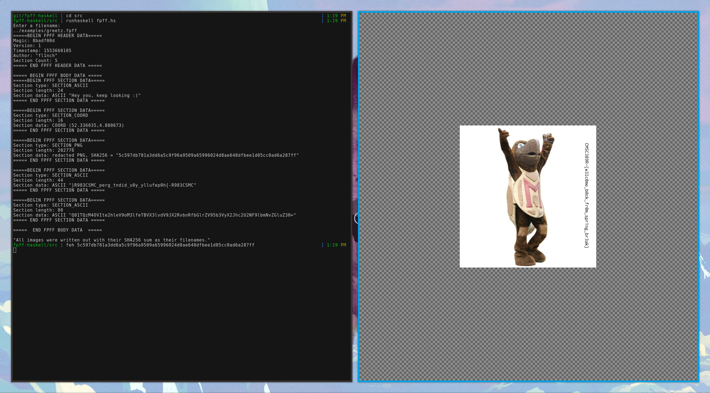

The Forensics Playground File Format
====================================

This project is a part of my final work for [CMSC388F: Functional
Pearls](http://www.cs.umd.edu/class/spring2019/cmsc388F/), a [Student Initiated
Course (STIC)](https://stics.umd.edu/) at the [University of Maryland, College
Park](https://umd.edu).

This project offers a parser for the Forensic Playground File Format (FPFF) in
Haskell. A modified version of the specification on which this parser is based
can be found [here](fpff-spec.md), while the original specification can be found
[here](https://github.com/UMD-CSec/fpff).

The Forensic Playground File Format (FPFF) is an open format designed to serve
as a sandbox for forensics education and competition. It has three main goals:

1. **Resemblance**. FPFF is similar to many common binary formats, making it a
good tool for familiarizing students with binary layouts and parsing.
2. **Uniqueness**. FPFF is different enough from real formats, preventing
automatic analysis with tools like `binwalk`.
3. **Flexibility**. FPFF's specification is simple, making extension and
modification straightforward.

## Running

The [`binary`](http://hackage.haskell.org/package/binary) package is required
for running this program. This can be installed by running:

```bash
$ cabal install binary
```

A standalone binary can be produced by compiling [src/fpff.hs](src/fpff.hs).

```bash
$ ghc -o fpff fpff.hs
```

It can also be interpreted directly by running:
```bash
$ runhaskell fpff.hs
```

This program will prompt a user for a filename in the FPFF format defined in the
aforementioned specification. It then prints out information as found in the
file, as well as dumps any image data with their filenames being their SHA256
sum (inclusive of their proper file signatures).



## Examples

An example FPFF file can be found at
[`examples/greetz.fpff`](examples/greetz.fpff).

## Pedagogical notes

Because a reference implementation is available, future course designers and
CTF challenge-builders are encouraged to modify the specification.

## License

The FPFF specification and this implementation are released under the MIT license.
